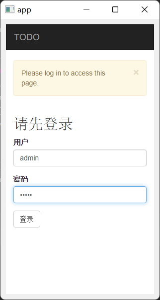
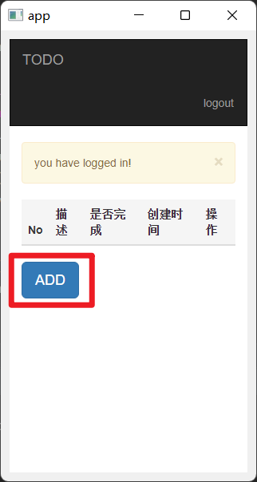
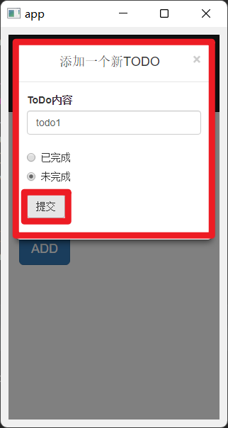
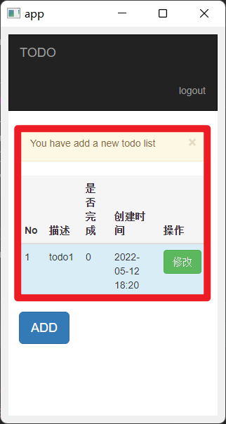
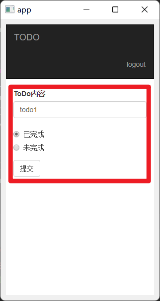
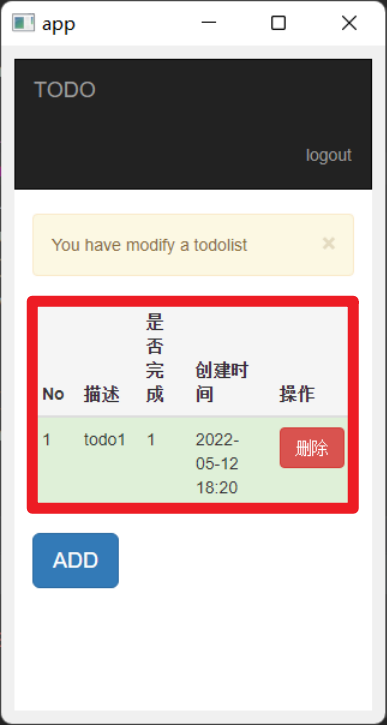

# TODO

**Simple Todo list**

手帳スケジュール管理、タスク管理ツール

### Flask　QT　SQLite　bootstrap　使用

#### 起動
Server --- server.py

GuiApp --- [DownLoad Here](https://github.com/Wedjat98/ToDoListAPP/releases/tag/alpha)

